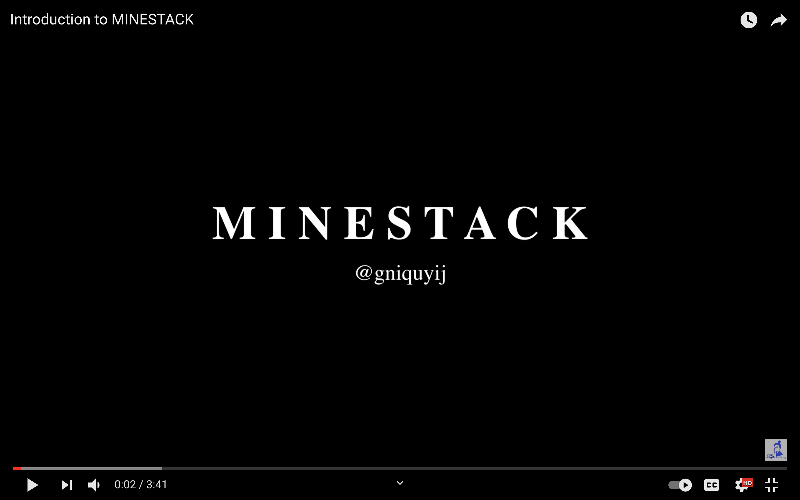

# MINESTACK

I decided not to play Minesweeper cause during university my roommate created a hardest-mode record I thought it impossible for me to break. Since then, I've been thinking about how to turn this around: practice, chance, etc. Days before, a light bulb moment:
Rather than moving forward with Minesweeper, how about a new track?

That's why I started MINESTACK, a 3D Minesweeper. Give it a try:
https://gniquyij.github.io/minestack

Here's a video on how to play MINESTACK - almost the same as Minesweeper.
