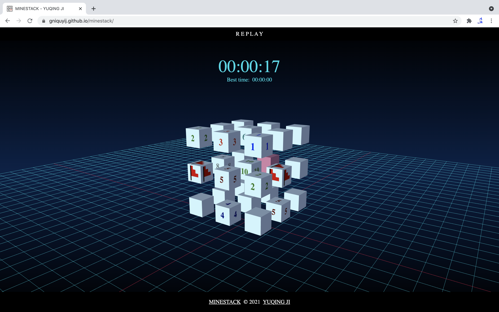

I decided not to play Minesweeper cause during university my roommate created a hardest-mode record I thought it impossible for me to break. Since then, I've been thinking about how to turn this around: practice, chance, etc. Days before, a light bulb moment:

Rather than moving forward with Minesweeper, how about a new track?

That's why I started MINESTACK, a 3D Minesweeper. Here's a video on how to play MINESTACK - almost the same as Minesweeper:

MINESTACK is a web game, currently a pure static piece. Any interests on the source code, here’s the reference:

- [https://github.com/gniquyij/minestack](https://github.com/gniquyij/minestack)

And…most importantly, give it a try! Enjoy!

- [https://gniquyij.github.io/minestack](https://gniquyij.github.io/minestack)

© 2018-2021 by YUQING JI

<a href="https://gniquyij.github.io/en/about">About</a> | <a href="https://gniquyij.github.io/">Blog</a> | <a href="mailto:yuqing.ji@outlook.com">Email</a> | <a href="https://github.com/gniquyij">Github</a> | <a href="https://gniquyij.github.io/zh">中文</a>
